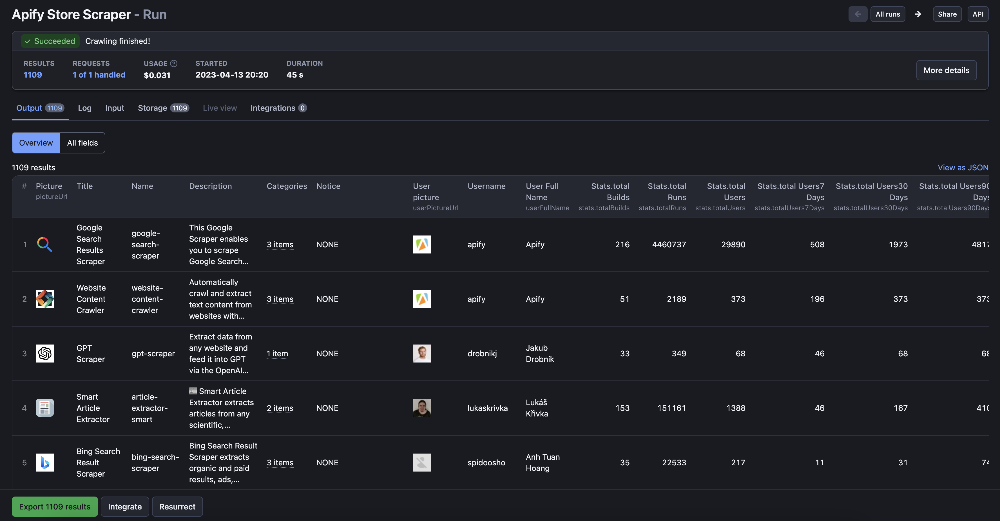

Apify Store Scraper
===============================

Apify Actor that scrapes Apify Store Actors.

## What is Apify Store Scraper and how does it work?

With Apify Store Scraper, you can extract data on all Actors on the [Apify's Store page](https://apify.com/store). Get detailed information about various actors, including their name, description, version, author, pricing model, cost, trial minutes, number of users, builds, and runs, and more.

## Features
- Scrape Apify Actor details from the [Apify Store](https://apify.com/store)
- Filter the results based on categories or search terms
- Download the dataset in JSON, JSONL, XML, CSV, Excel, or HTML formats

## How can you use scraped Apify Store data? (Use cases)
- Analyze the Apify Actor ecosystem and identify popular actors
- Monitor newly released actors and updates
- Discover new actors for your web scraping needs
- Conduct market research on web scraping and automation tools

## How to use Apify Actor Scraper
1. Create a free Apify account using your email
2. Open Apify Actor Scraper
3. Choose a category or a search term to narrow down the results (optional).
4. Click "Start" and wait for the data to be extracted.
5. Download your data in JSON, JSONL, XML, CSV, Excel, or HTML format.

Available categories: AI, Automation, Business, Covid-19, Developer Examples, Developer Tools, E-commerce, Games, Jobs, Marketing, News, SEO Tools, Social media, Travel, Videos, Real estate, Sports, Education, Other.

## How much does it cost to scrape Apify Store?
This scraper is free, you pay only for usage!

Cost of full run (~ 1100 actors):
- One-off run - $0.031
- Every day - less than $1 per month ($0.961 = 31 * $0.031)

Remember that with the [Apify Free plan](https://apify.com/pricing) you have $5 free usage per month.

## Is it legal to scrape Apify Store?
It is legal to scrape publicly available data such as product descriptions, prices, or ratings. Read Apify's blog post on [the legality of web scraping](https://blog.apify.com/is-web-scraping-legal/) to learn more.


## Input options

You can run Apify Store Scraper as is, with the default options. This will give you the full list of all actors from all categories.

You can also filter actors by category or search term ("query"). Hence you can use Apify Store Scraper to check for existence of actors for specific websites.

For details and examples for all input fields, please visit the [Input tab](https://apify.com/jurooravec/apify-store-scraper/input-schema).

### Example 1: Get all actors from Apify Store

```json
{
  "startUrls": ["https://apify.com/store"],
}
```

### Example 2: Get E-commerce "Facebook" actors
```json
{
  "startUrls": ["https://apify.com/store"],
  "query": "facebook",
  "category": "E-COMMERCE"
}
```

## Output

Once Apify Store Scraper is done, you can see the overview of results in the Output tab. Head over to the Storage tab to export the dataset as JSON, HTML, CSV, or Excel.



## Sample output from Apify Store Scraper

```json
{
	"title": "Forever21 Scraper",
	"name": "forever21-scraper",
	"username": "epctex",
	"stats": {
		"totalBuilds": 57,
		"totalRuns": 691,
		"totalUsers": 43,
		"totalUsers7Days": 2,
		"totalUsers30Days": 2,
		"totalUsers90Days": 2,
		"lastRunStartedAt": "2023-04-13T03:45:09.418Z"
	},
	"description": "Extract any product data from Forever21 easily! Images, sizes, SKUs, quantities, colors, and many more values are ready for you. Search for any keyword, filter by your needs, or get category pages! Export your data by XML, JSON, CSV, Excel or HTML.",
	"pictureUrl": "https://apify-image-uploads-prod.s3.amazonaws.com/vetQadT3W7gHG48Np/L3YCNegYjCtjj9LFh-unnamed.png",
	"notice": "NONE",
	"userPictureUrl": "https://images.apifyusercontent.com/zCiSEGPDUfomBFKNm9nnOm9A_o8Bkijm3NdNE6UWP8A/rs:fill:32:32/aHR0cHM6Ly9hcGlmeS1pbWFnZS11cGxvYWRzLXByb2QuczMuYW1hem9uYXdzLmNvbS8zcWhBY1MzWlJKSzRhN3VORy9oczZrNXo2akNNNkpHY3U0Qi1zcXVhcmUtYmxhY2sucG5n.png",
	"userFullName": "epctex",
	"currentPricingInfo": {
		"pricingModel": "FLAT_PRICE_PER_MONTH",
		"pricePerUnitUsd": 30,
		"trialMinutes": 4320,
		"createdAt": "2023-01-13T11:00:17.436Z",
		"startedAt": "2023-01-13T11:00:17.436Z",
		"apifyMarginPercentage": 0
	},
	"objectID": "vetQadT3W7gHG48Np",
	"categories": [
		"ECOMMERCE"
	]
}
```

## How to integrate Apify Store Scraper with other services, APIs or Actors
You can connect Apify Store Scraper with many of the [integrations on the Apify platform](https://apify.com/integrations). You can integrate with Make, Zapier, Slack, Airbyte, GitHub, Google Sheets, Google Drive, [and more](https://docs.apify.com/integrations). Or you can use [webhooks](https://docs.apify.com/integrations/webhooks) to carry out an action whenever an event occurs, e.g. get a notification whenever Instagram API Scraper successfully finishes a run.

## Use Apify Store Scraper with Apify API
The Apify API gives you programmatic access to the Apify platform. The API is organized around RESTful HTTP endpoints that enable you to manage, schedule and run Apify actors. The API also lets you access any datasets, monitor actor performance, fetch results, create and update versions, and more.

To access the API using Node.js, use the `apify-client` NPM package. To access the API using Python, use the `apify-client` PyPI package.

Check out the [Apify API reference](https://docs.apify.com/api/v2) docs for full details or click on the [API tab](https://apify.com/jurooravec/apify-store-scraper/api) for code examples.
